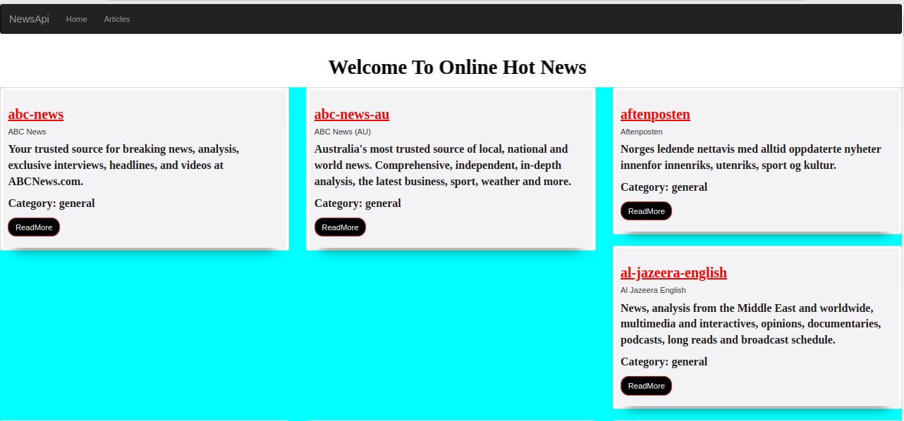
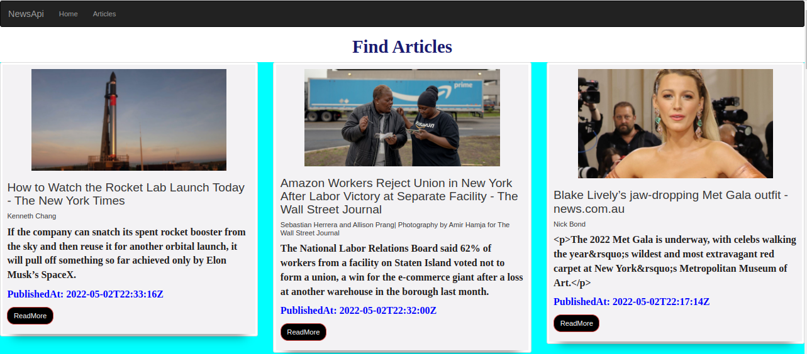

# News Application

### Home page

### Articles Page

##### By Catherine Kimani

### A Description of a News Application

## Table of Content

+ [Description](#description)
+ [Installation Requirement](#Installation)
+ [Technology Used](#technology-used)
+ [Licence](#licence)
+ [Authors Info](#author-Info)

## Description

 A Flask application that displays various news sources and articles using Newsapi 

## Installation Requirements

* Make sure you have access to a browser
* Make sure you have access to the internet
* Create a GitHub account

## Technology Used

Flask

## Licence

MIT License

copyright (c) [2022] [Catherine Kimani](LICENCE)

[Go Back to the top](# News Application)

## Author's Info

LinkedIn - [Catherine Kimani](https://www.linkedin.comcatherine-kimani-5464ba1b6/)

[Go Back to the top](# News Application)